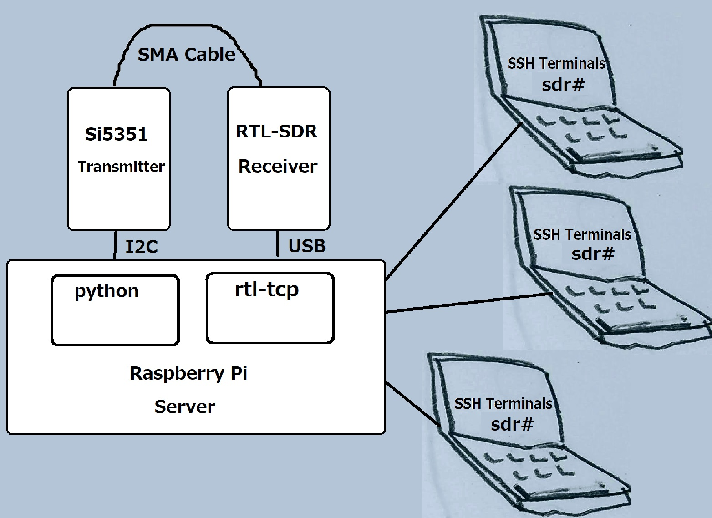
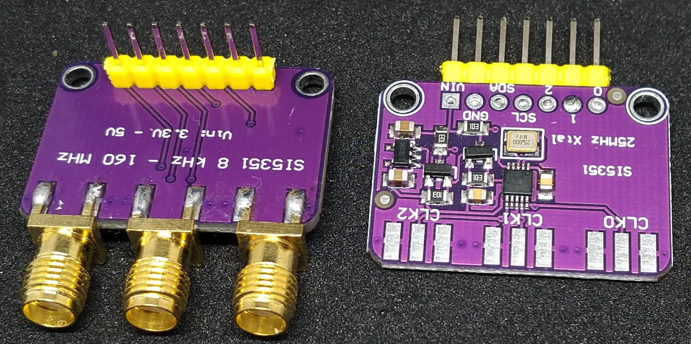
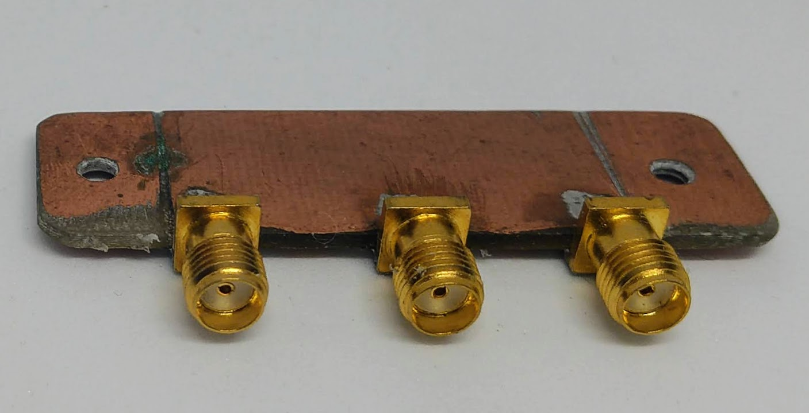
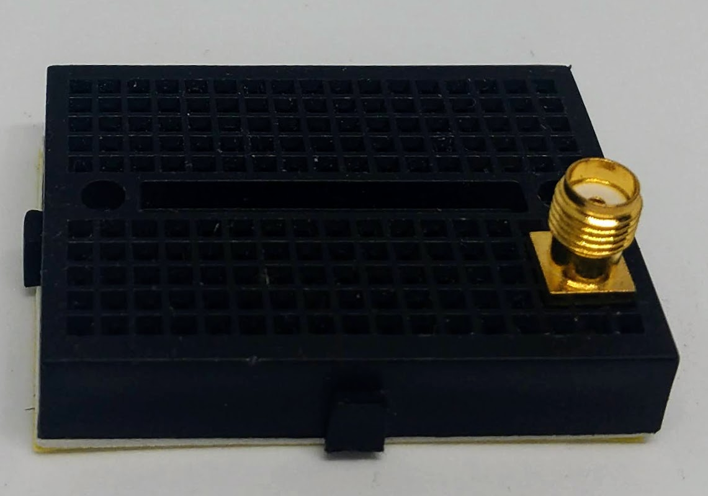
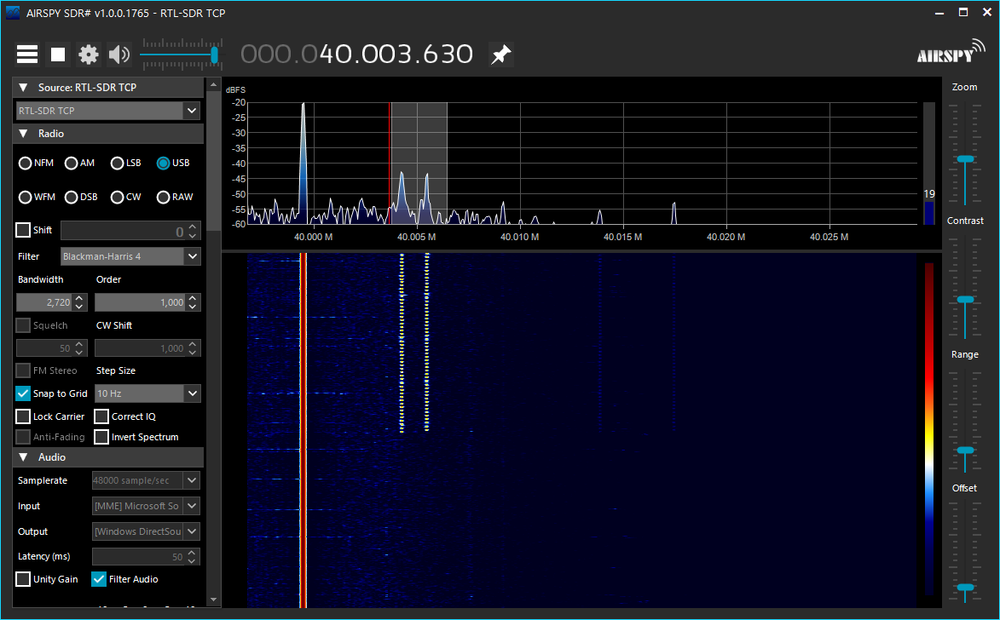
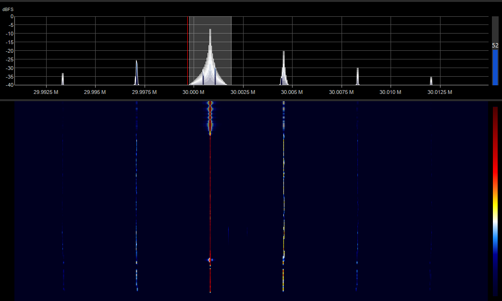
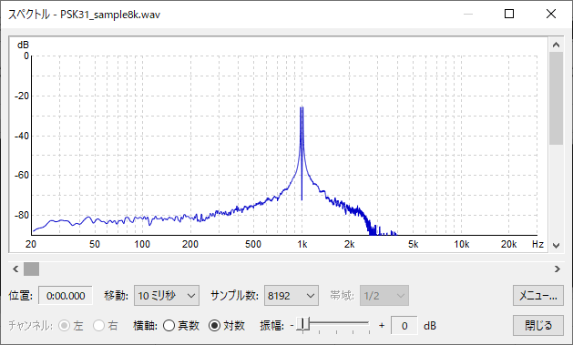
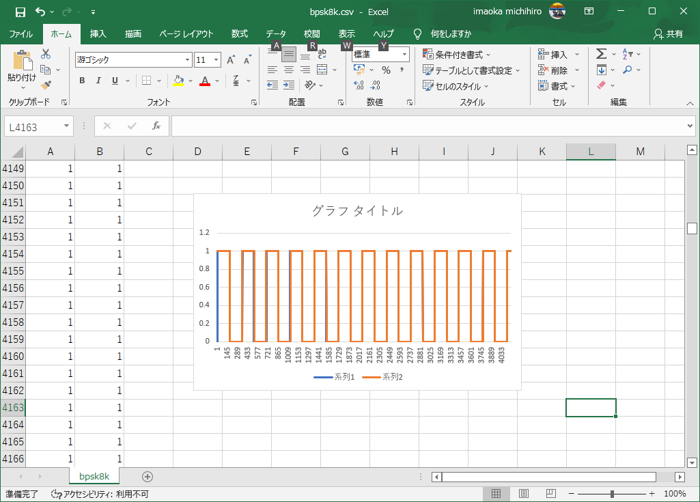
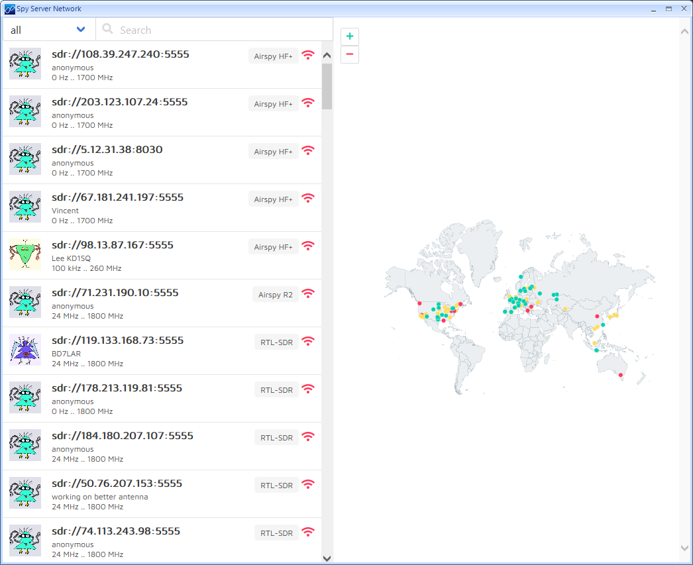

# RF( Radio Frequency ) Offensive and Defense Exercise Server

Michihiro Imaoka

---
## Bio

Michihiro Imaoka is a founder of Imaoca Engineering Office in Japan. He is also a FPGA developer, an embedded system developer, and a technical writer. He has been a Microsoft MVP since 2014 (Windows development), Black Hat USA Arsenal presenter in 2020 and 2021.

---

## Introduction
I will report that we have built a server that allows radio communication exercises in electronic warfare.

The actual emission of radio waves is strictly regulated in each country. So an anechoic chamber was necessary for these exercises, but this server can provide an inexpensive environment for these exercises. In this server, all RF communications will take place inside a cable.
In this presentation, We would like to try to intercept one of those attacks. Generates BPSK(Binary Phase Shift Keying) radio signals at a transmission side. At the receiver side attempts to decode the signal into 0s and 1s. 
In the preliminary draft, I wrote that FSK(Frequency Shift Keying) will be used, but since recent military radio communications are shifting to PSK, PSK will be used in this presentation.

---
## Types of Attacks on Wireless Communications
- interception
- jamming- 
- tampering
- poofing.

---

## System diagram

---
## si5351a module

- it is a transmitter for this system
- Signal Generator Breakout Board Module,  8KHz-160MHz
- there are 3 outputs
- DC 3V-5V  
- I2C connected with Raspberry pi
- US $2.05 - 2.25, not include shipping fee    

---
## RTL-SDR (This is a photo of the case removed.)

- it works on raspberry pi as a receiver.
- Coverage from 30 MHz to 1.8 GHz or more. 
- R820T2+FC0012 chip.
- I brazed the SMA connector on the original connector.
- about 10 dollers
---
## SMA cable

- These are the cables used in this server.
- It is shielded so that RF signals do not leak outside.
- It can be used up to high frequencies with low loss.
- It is commonly used in RF equipment these days.

---
## RF Distributer for SMA cables

In the server shown in this case, the sender and receiver were one-to-one, so they were connected directly with SMA cables.
If there are multiple RF nodes, use a distributor like this one.
I made it.

---
## RF Bread board

This is a breadboard with SMA connectors.
It is useful for RF electronics.
We used it with si5351a.
This is our original.

---
## rtl-tcp
- rtl-tcp runs on the server side.
- The signal received by RTL-SDR is put on tcp and distributes.

---
## exercise scenario
In this exercise, the trainee will find and demodulate the sender's BPSK signal.

---
## SDR# (SDR sharp)

- SDR# is software that runs on the trainee's PC.
- It is software for receiving radio signals.
- In this exercise, the source is set to "RTL-SDR TCP".
- This software is free and open source.

---
## generate carrier on the server with si5351a
~~~
import board
import busio
import time

import adafruit_si5351

i2c = busio.I2C(board.SCL, board.SDA)
si5351 = adafruit_si5351.SI5351(i2c)

si5351.pll_a.configure_integer(36)
si5351.clock_0.configure_integer(si5351.pll_a, 30)
si5351.outputs_enabled = True
~~~
The module has a 25 MHz crystal oscillator. Multiply it by 36 to 900 MHz. Divide that by 30 to produce a 30MHz output signal.

---
## This shows some registers in the datasheet for si5351a .

The fourth bit of the 16th register has the function of inverting the output signal.

---
## bpsk encodeing 
~~~
import time
import smbus

I2C = smbus.SMBus(1)
while True:
        i = I2C.read_byte_data(0x60, 16)
        I2C.write_byte_data(0x60, 16, i | 0x10) # CLK0_INV=1
        time.sleep(0.02)
        i = I2C.read_byte_data(0x60, 16)
        I2C.write_byte_data(0x60, 16, i & 0xEF) # CLK0_INV=0
        time.sleep(0.02)
~~~
The fourth bit of the 16th register is repeated set and cleared every 20 ms.

---

## sdr# settings to recive bpsk from RPi Server

- Source is "RTL-SDR TCP"
- Frequency 30MHz
- Mode is USB (Upper Side Band)
- Bandwidth 2.2KHz
- Received signals are recorded in WAV format for demodulation.

---

## receive by sdr# bpsk RF signal

If the trainee finds a signal near 30 MHz, the sdr# screen will look like this figure.

---

## bpsk decoding

~~~
import wave
import math
import numpy as np

fname='psk31_sample8k.wav'  # should be specify the filename.
smp= 8000           # Sampling Rate
FQ= smp/1000.0      # Signal Frequency 
wind= 40            # window
waveFile = wave.open(fname, 'r')
q=[];i=[]
for j in range(waveFile.getnframes()):
      buf = waveFile.readframes(1)
      q.append((buf[0]-128)*np.sin(np.pi*2.0/FQ*j))
      i.append((buf[0]-128)*np.cos(np.pi*2.0/FQ*j))
      print(int(sum(q)>0),int(sum(i)>0),sep=",")
      if j>wind:q.pop(0);i.pop(0)
waveFile.close()
~~~
https://github.com/imaoca/psk31
Received WAV files are converted to 0 or 1 with this program.

---
### Parameters

Some parameters in the source code need to be modified according to the audio file to be input.
- fname should be specify the filename.
- smp is Sampling Rate.
- FQ is Signal Frequency. This sound example should be 1000.0. This figure shows the spectral distribution of a sample sound file. There is a peak around 1000Hz.

---
### Complex Planes and Value Assignment
Modify this line if you want to change the value assignment for the complex planes.
~~~
print(int(sum(q)>0),int(sum(i)>0),sep=",")
~~~

---
### Usage
Please specify an appropriate audio file for the input. This program assumes 8KHz sampling, mono, 8bit quantization, and no sign.
~~~
 python psk31.py > psk31_sample8k.csv
~~~

---

### The decoded BPSK is shown in the graph.

You can see that the 0s and 1s are repeated at equal intervals as when encoded on the transmitter side.

---
## So far we have talked about the exercise server, but now we will talk about how to receive actual military communications.

---

## STANAG 4285 
STANAG 4285 is specified by the NATO for Standardization in "Characteristics of 1200 / 2400 / 3600 Bits per Second Single Tone Modulators / Demodulators for HF Radio Links". 
It is PSK.

https://sigidwiki.com/wiki/Unknown_16p4732_PSK_Serial

---
## SDR# settings to recive real STANAG 4285 on the air

- Set the SDR# source to "Spy Server Network".
- This figure lists the Spy Server locations and the connection links to the servers.
- Since STANAG 4285 is PSK, the other settings are the same as when receiving BPSK.
- I would appreciate it if you could try my program (psk31.py) to see if it works to decode.

---
## conclusion
- Since radio wave experiments are not allowed outside, we showed a method that can be done inside the cable.
- I also showed how to transmit, receive, and encode BPSK.
- I also showed how to intercept a real STANAG  4285.

---

# Let's enjoy RF Hacking.
# Thank you